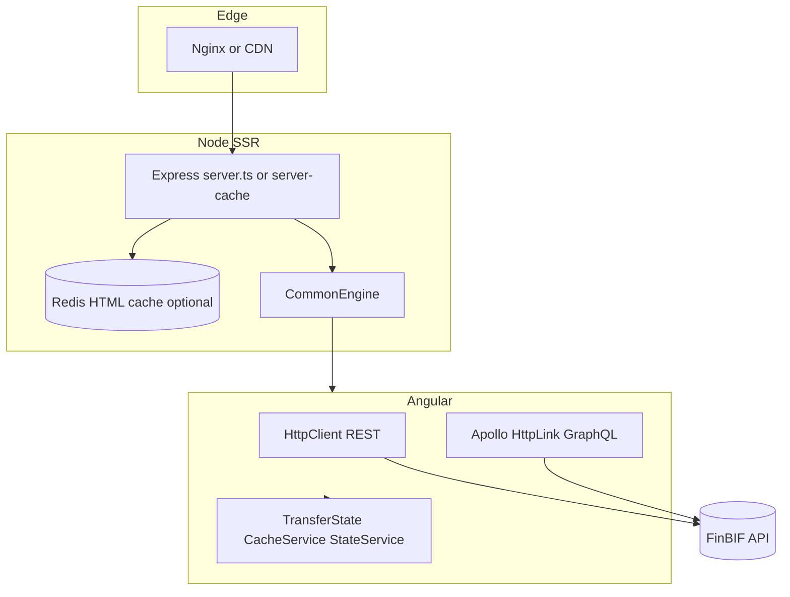

# Frontend codebase review (deepened)

## Working assumption

**Backend/API data is treated as safe** (sanitized or trusted HTML/text from your services). Under that assumption:

- **`[innerHTML]` and the `safe` pipe** are acceptable *for that data*; residual risk is **not** “malicious API” but **defense in depth** (third-party scripts, browser extensions, compromised CDN, future CMS mistakes). Optional: CSP/SRI as infrastructure policy, not a front-end emergency.
- **Person-Token in local storage** remains a **browser threat model** topic (XSS from *any* source, malicious extensions), not something the API contract alone fixes.

---

## 1. SSR architecture (highest depth / highest impact)

### 1.1 Two server entry stories

- **[`projects/laji/server.ts`](projects/laji/server.ts)** — minimal Express + `CommonEngine`: static `**`, then SSR `**`. No Redis, no `server-cache` middleware in this file.
- **[`projects/laji/server-cache.ts`](projects/laji/server-cache.ts)** — **Redis-backed HTML cache**, hijacks `res.render`, TTL logic, `x-cache` headers. Comments assume integration **before** a middleware that renders HTML.

**Action**: Document which production path uses which server; ensure **one** supported story per environment so behavior (caching, headers, errors) is predictable. Mis-wiring here causes “works locally, stale/wrong in prod” classes of bugs.

### 1.2 `TimeoutInterceptor` + SSR (500ms, `EMPTY`)

[`projects/laji/src/app/shared/interceptor/timeout.interceptor.ts`](projects/laji/src/app/shared/interceptor/timeout.interceptor.ts) uses **500ms** on the server and maps errors to **`EMPTY`**, swallowing failures during SSR.

**Effects**:

- Requests that exceed 500ms produce **no error** and **no emission** — downstream code may see empty streams or missing data without a clear failure.
- Differs sharply from the **30s** browser path, so **server-rendered HTML can disagree** with client re-fetch after hydration.

**Suggested direction**: Per-request policy — e.g. higher default SSR timeout, opt-out header for “must complete”, structured **server-side logging** when timeout/empty happens, and avoid `EMPTY` for data required for SEO or critical above-the-fold UI.

### 1.3 `CacheService` + `TransferState` (subtle correctness)

[`projects/laji/src/app/shared/service/cache.service.ts`](projects/laji/src/app/shared/service/cache.service.ts) implements `getCachedObservable` with branches for browser vs server and `ApplicationRef.isStable`.

**Why it needs a focused review**:

- Logic mixes **“transfer server → browser”** with branches where the **browser** path **`set`s TransferState** on emissions (unusual compared to typical “server sets, client reads” patterns).
- Dependency on **`isStable`** + **5s timeout** on the browser can mask hangs.

**Action**: Trace **every call site** of `getCachedObservable`; verify ordering matches Angular SSR expectations and does not cause **double fetch**, **stale transfer**, or **hydration mismatch** warnings.

### 1.4 `StateService` vs dead code

[`projects/laji/src/app/shared/service/state.service.ts`](projects/laji/src/app/shared/service/state.service.ts) wraps a **single serialized blob** under one `makeStateKey('l')` and mutates it with `set(key, value)`.

**Finding**: No other file in the repo references `StateService` by import (only similarly named `TreeStateService`). **Likely dead code** or an incomplete migration.

**Action**: Confirm usage; remove or formally adopt and document the transfer-state contract (otherwise future SSR work may duplicate or conflict with `CacheService`).

### 1.5 `provideClientHydration()` + GraphQL cache

[`projects/laji/src/app/app.module.ts`](projects/laji/src/app/app.module.ts) enables **`provideClientHydration()`**. GraphQL [`createApollo`](projects/laji/src/app/graph-ql/graph-ql.module.ts) resets **`InMemoryCache` on every language change** via `translateService.onLangChange` (subscription with `console.error` on failure).

**Watch points**:

- Hydration + aggressive cache reset can interact with **initial navigation** and **lang** if not sequenced carefully.
- Long-lived subscription on `onLangChange` should use a **single teardown strategy** (e.g. `takeUntilDestroyed` if moved to an initializer scoped to app lifetime, or explicit destroy in a wrapper service).

---

## 2. HTTP / GraphQL consistency (deep)

### 2.1 Duplicate `provideHttpClient` registrations

- **AppModule**: `provideHttpClient(withInterceptorsFromDi(), withFetch())` + **`TimeoutInterceptor`**.
- **GraphQLModule**: `provideHttpClient(withInterceptorsFromDi())` + **`AcceptLanguageInterceptor`**.

Angular merges module providers, but **order and `withFetch()`** only on one side deserve verification: Apollo **`HttpLink`** must use an `HttpClient` that applies **both** language and timeout behavior intended for production.

**Action**: Single place (e.g. `app.config` or one `provideHttpClient`) listing **functional interceptors** in explicit order, or integration test proving GraphQL and REST see the same timeout/lang headers on SSR and browser.

### 2.2 `LajiApiClientBService` — unbounded in-memory GET cache

[`projects/laji-api-client-b/src/laji-api-client-b.service.ts`](projects/laji-api-client-b/src/laji-api-client-b.service.ts) keeps a **nested `Map` cache** for GET requests with **`share()`** and time-based invalidation per entry.

**Risk on SSR / long-running Node**:

- Many distinct paths + query hashes → **memory growth** across requests in a **single Node process** (unless the process recycles frequently).
- **Language / `personToken` changes** interact with cache keys — confirm `paramsHash` and flush rules include everything that must vary (avoid wrong cached body for another user/lang).

**Action**: Capacity planning (max entries, LRU, or periodic flush on server), and tests for **auth** and **lang** boundaries.

---

## 3. Security (reframed under trusted API)

| Topic | Under trusted API |
| ----- | ------------------- |
| `innerHTML` / `safe` | Lower urgency; optional CSP/SRI for CDN/bootstrap as policy |
| Token in `localStorage` | Still relevant for **non-API** XSS and extensions; HttpOnly cookies = backend change |
| `npm audit`, `xlsx` | Still high value (supply chain, import path) |
| Express [`server.ts`](projects/laji/server.ts) | Trust boundaries: if Node is behind nginx, headers may live at the edge; if not, add standard hardening |

---

## 4. Stability beyond subscriptions

- **Global error handler** [`LajiErrorHandler`](projects/laji/src/app/shared/error/laji-error-handler.ts): intentional suppression of certain Angular errors; confirm **SSR 500** behavior does not fight CDN cache (e.g. error page cached as 200 via Redis layer).
- **RxJS**: Prefer `async` pipe / `takeUntilDestroyed` for routed components; enable targeted **eslint-plugin-rxjs** rules where churn is acceptable.

---

## 5. Clarity and maintainability

- **`@typescript-eslint/no-explicit-any` is off** ([`.eslintrc.js`](.eslintrc.js)) — phased enablement for new modules and API boundaries.
- **Debug noise**: e.g. `console.log` in [`select-fields-modal-gear.component.ts`](projects/laji/src/app/shared-modules/select-fields/select-fields-modal-gear/select-fields-modal-gear.component.ts) — gate or remove.
- **Legacy**: `moment`, `rxjs-compat` — track bundle cost and removal feasibility.

---

## 6. Testing and observability (not run in this review)

- **Playwright** in [`package.json`](package.json) — extend coverage for **SSR routes** and **lang switch** if not already present.
- **Structured logging** for SSR timeouts and cache hit/miss (align with `x-cache` from Redis middleware when used).

---

## 7. Architecture diagram (SSR + cache layers)

---

## 8. Suggested sequencing (updated)

1. **SSR pipeline audit** — TimeoutInterceptor, CacheService call sites, Redis vs plain server, hydration.
2. **HttpClient / GraphQL** — one interceptor story, verify SSR + browser.
3. **API client cache** — memory and correctness (lang/token).
4. **Dependencies** — `npm audit`, `xlsx` upgrade path.
5. **Dead code** — `StateService`, stray logs.
6. **ESLint / RxJS** — phased tightening.

---

## What was not executed here

No `npm audit`, runtime DI verification, or Playwright run — those should validate the items above.
